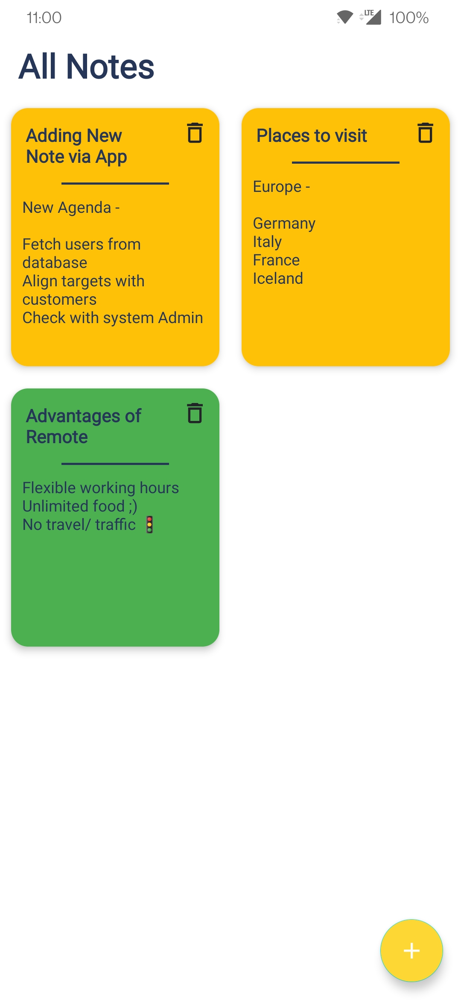

# SNotes
## SNotes is a Simple Notes App

Simple and minimal note-taking Android application built with Kotlin.
 
## Architecture

The app uses Clean Architecture with MVVM design pattern and it's divided into 3 main layers.

## App Features :

1. Add Notes - Title and Body
2. Save and display notes
3. Delete any saved note
4. Edit any note
5. Quick Actions to add/delete note

## Screenshots
 
<table>
  <tr>
    <td></td>
    <td></td>
    <td></td>
  </tr>
</table>

